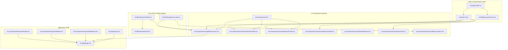

# Dependency Graph

```mermaid
flowchart TD
    subgraph Data [Data & Governance Layer]
        Schemas[src/types/index.ts]
        CanonicalData[src/data/*.json]
        Governance[src/lib/data-governance.ts]
        Schemas --> CanonicalData
        Schemas --> Governance
    end

    subgraph CoreEngine [Core GIS & Utility Engines]
        CoordEngine[src/lib/map/coordinates.ts]
        RouteEngine[src/lib/route/optimizer.ts]
        StorageService[src/lib/storage/user-state.ts]
    end

    subgraph Components [UI Component Systems]
        DesignSystem[src/components/ui/*]
        MapCanvas[src/components/map/MapCanvas.tsx]
        VehicleView[src/components/vehicles/VehicleFinder.tsx]
        MoneyView[src/components/money/MoneyFinder.tsx]
        MissionView[src/components/missions/MissionGuide.tsx]
        RouteView[src/components/route/RoutePlanner.tsx]
        XboxView[src/components/xbox/XboxGuide.tsx]
        PersonalView[src/components/personal/MyLocations.tsx]
    end

    subgraph Shell [Application Shell]
        AppLayout[src/app/layout.tsx]
        MainPage[src/app/page.tsx]
        NavHeader[src/components/layout/Header.tsx]
        Sidebar[src/components/layout/Sidebar.tsx]
        MobileNav[src/components/layout/MobileNav.tsx]
    end

    CanonicalData --> MapCanvas
    CanonicalData --> VehicleView
    CanonicalData --> MoneyView
    CanonicalData --> MissionView
    CanonicalData --> XboxView

    CoordEngine --> MapCanvas
    CoordEngine --> RouteEngine
    StorageService --> PersonalView
    StorageService --> MapCanvas

    DesignSystem --> MapCanvas
    DesignSystem --> VehicleView
    DesignSystem --> MoneyView

    NavHeader --> MainPage
    Sidebar --> MainPage
    MobileNav --> MainPage
    MapCanvas --> MainPage
    AppLayout --> MainPage
```
